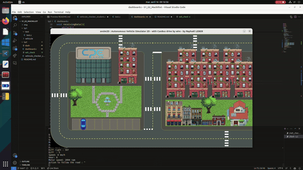
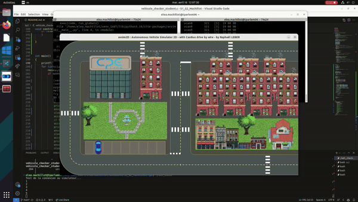
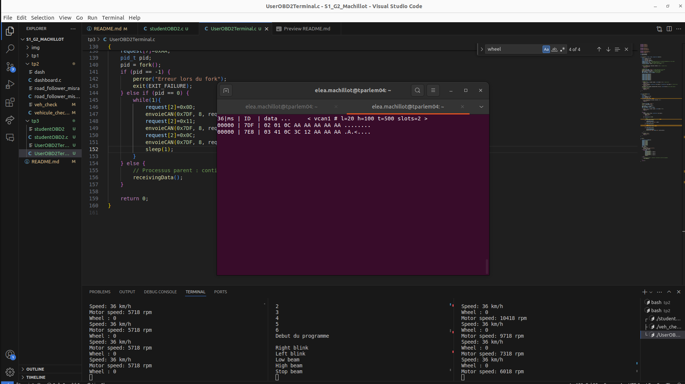

# README
 
## Basic commands 
* Create a virtual env :
```bash
python3 -m venv venv_SAdT 
```
* Sourcing your virtual env (after every change or opened terminal)
```bash
source venv_SAdT/bin/activate
```
* Install the simulator 
```bash
pip install jinja2
pip install typeguard
pip install avsim2D
```
* Test the simulator 
```bash
python -m avsim2D --no-CAN True
```
* Set a virtual CAN network
```bash
sudo modprobe vcan # Load virtual CAN Kernel module
sudo ip link add dev vcan0 type vcan # Add virtual CAN socket called vcan0
sudo ip link set up vcan0 # Set vcan0 up
```

* Compile and exec our vehicule checker code
```bash
gcc -Wall -Wextra vehicule_checker_student.c -o veh_check
./veh_check
```

* Run the simulator
```bash
python -m avsim2D
```

* Compile and exec our dashboard code
```bash
gcc -Wall -Wextra dashboard.c -o dash
./dash
```

* Use Misra:
1. On CPE desktop :
```bash
sudo apt-get update
sudo apt-get install python-minimal
alias cppcheck='/softwares/INFO/Robotique/CppCheck/cppcheck'
cppcheck --addon=misra road_follower_misra.c
```
2. On your pc :
```bash
git clone https://github.com/danmar/cppcheck.git
cd cppcheck
mkdir build
cd build
cmake ..
cmake --build .
sudo make install
sudo apt-get update
sudo apt-get install cmake
sudo apt-get install python-minimal
cppcheck --addon=misra road_follower_misra.c
```

* Set a virtual CAN network 2
```bash
sudo modprobe vcan # Load virtual CAN Kernel module
sudo ip link add dev vcan1 type vcan # Add virtual CAN socket called vcan0
sudo ip link set up vcan1 # Set vcan0 up
```

* Set a virtual CAN network 3
```bash
sudo modprobe vcan # Load virtual CAN Kernel module
sudo ip link add dev vcan2 type vcan # Add virtual CAN socket called vcan0
sudo ip link set up vcan2 mtu 72
```

## TP1
### Common tools
* Candump and cansend :  


### Our own C code
* How would you proceed to put for exemple the decimal value 42 in the 2nd octet of frame.data (cantransmit.c , line 42)  
The hard way :
    ```bash
    sprintf(frame.data, "HBllo");
    ```
    or you can just say : 
    ```bash
    frame.data[2] = 42;
    ```

* You received 0x8123 on candump and not 0x123 (ID on 29bits and not 11)


* Your filter works well with false negatives or false positives. Write. Highlight relevant examples.  


* Check how to do the same filtering (keep IDs 0x100 to 0x1FF) with candump using arguments. Highlight relevant examples.
    ```
    Comma separated filters can be specified for each given CAN interface: 
    <can_id>:<can_mask> 
    (matches when <received_can_id> & mask == can_id & mask) 
    <can_id>~<can_mask> 
    (matches when <received_can_id> & mask != can_id & mask) 
    #<error_mask> 
    (set error frame filter, see include/linux/can/error.h) 
    [j|J] 
    (join the given CAN filters - logical AND semantic) 
    ```
### Hack a car
* Blink right blinkers
```bash
19|ms | -- ID -- | data ...     < vcan0 # l=20 h=100 t=500 slots=10 >
^C972 | ---- 123 | 00 01   
```
* Blink left blinkers
```bash
58|ms | -- ID -- | data ...     < vcan0 # l=20 h=100 t=500 slots=9 >
^C000 | ---- 123 | 00 02                   
```
* Switch low beam on/off
```bash
84|ms | -- ID -- | data ...     < vcan0 # l=20 h=100 t=500 slots=10 >
^C000 | ---- 123 | 01 00   
```
* Switch high beam on/off
```bash
51|ms | -- ID -- | data ...     < vcan0 # l=20 h=100 t=500 slots=9 >
03000 | ---- 123 | 02 00                   
```
For the ID 123, the first octet correspond to beam :  

0 -> no beam 

1 -> low beam

2 -> high beam 


For the ID 123, the second octet correspond to blinkers :  

0 -> no blinkers

1 -> right blinkers

2 -> left blinkers

## TP2
### Features 
* Can you identify some of these classes on this image ? 


*  For each area, describe what is seen by the vehicle, as you can see in this exemple for the 2nd frame : 
```bash
  vcan0  00000C00   [8]  5C 00 0A 00 00 00 00 00
```
- In the full left (ID 0xC00): Road (92%) and yield (10%)

```bash
  vcan0  00000C01   [8]  64 00 01 02 00 00 00 00
```
- In the left (ID 0xC01): Road (100%), yield (1%) and crossing (2%)

```bash
  vcan0  00000C02   [8]  64 00 00 03 00 00 00 0E
```
- In the middle left (ID 0xC02): Road (100%), crossing (3%) and reserved (14%)

```bash
  vcan0  00000C03   [8]  64 00 00 01 00 00 00 1B
```
- In the middle right (ID 0xC03): Road (100%), and crossing (1%) and reserved (27%)

```bash
  vcan0  00000C04   [8]  44 00 00 00 00 00 00 11
```
- In the right (ID 0xC04): Road (64%) and reserved (17%) 

```bash
  vcan0  00000C05   [8]  2B 00 00 00 00 00 00 03
```
- In the full right (ID 0xC05): Road (43%) and reserved (3%) 

### Re-code vehicle_checker

* Make a GIF or a video to demonstrate (you can do a unique video with the section 3 if you prefer). Explain your way to do your code.  

(See below with the dashboard)


### Code a dashbord

* Make a GIF or a video to demonstrate (you can do a unique video with the section 2 or 4 if you prefer). Explain your way to do your code. 



### Start a closed loop approach 

* Make a GIF or a video to demonstrate (you can do a unique video with the section 3 if you prefer). Explain your way to do your code.   



## TP2B

### Practical work 2
*  With your 50 own words (+/- 10) explain what is MISRA (preferably in  french)

> Misra est un projet quia été lancé en 1990 et qui a comme mission de créer une feuille de route / guide des meilleures pratiques afin de créer des des applications sécuritaire et sûre que ce soit pour le la programmation embarqué ou non. Il y a MISRA C qui est un standart de programmation emmanant du language C.

### Identify MISRA non-compliant code

* For each of these 3 rules, check if they are required for misra-compliance or if they are just advisement : 

R 2.7 - There should be no unused parameters in functions 
**Advisement** 

R 3.1 - The character sequences /* and // shall not be used within a comment  
**Misra-compliance** 

R 13.4 - The result of an assignment operator should not be used 
**Misra-compliance** 
 
 ### Make your code a bit more MISRA compliant

* Now you have to modify road_follower_misra.c with this purpose : remove every occurences of at least 3 different kind of misra violations, NOT all. If possible, choose 3 different static analysis categories (control-flow, points-to, arithmetic). Explain in your report how this compliance can avoid misleading a future developer in this specific code.

All return 1 have been changed : 

```bash
if ((s < 0) || (bind(s, (struct sockaddr *)&addr, sizeof(addr)) < 0) || (write(s, &frame, sizeof(struct can_frame)) != sizeof(struct can_frame)) || (close(s) < 0))
        {
            perror("Error");
            result= 1; 
        }
    else {
      #CODE
    }

```

All function has now a type in () : 

```bash
int controlCar(void){
  #CODE 
  }
``` 

Condition now has () : 

```bash
if (frame2.can_id >= 0xC00 && frame2.can_id <= 0xC07)  
```

is now 

```bash
if ((frame2.can_id >= 0xC00) && (frame2.can_id <= 0xC07)) 
```

## TP3 

### Create a simplified OBD2 diagnostic interface

* Getting a "printscreen" of UserOBD2Terminal output with a candump trace can be a good way to prove it works


### Optimise sensors data transmission with CAN-FD
